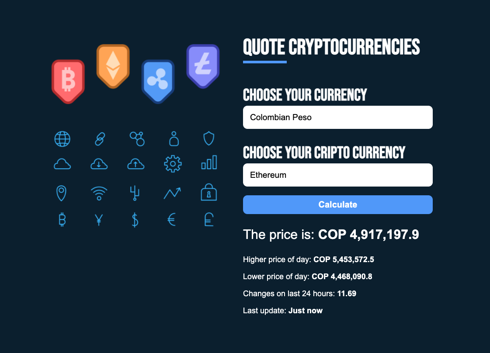

  <h1> 💵 💶  Cryptocurrency converter react app 💶 💵  </h1>
  
React app to convert your cryptocurrencies in your prefer currency

    
  
   
   
  
Final result

  
<strong>https://david-portilla.github.io/cryptocurrency/</strong>

   

## Features

- [x] API rest with AXIOS
- [x] Custom hooks
- [x] Styled component

## Instructions

Select your currency and the crypto you want

## Available Scripts

In the project directory, you can run:

### `npm start`

Runs the app in the development mode.\
Open [http://localhost:3000](http://localhost:3000) to view it in the browser.

The page will reload if you make edits.\
You will also see any lint errors in the console.
